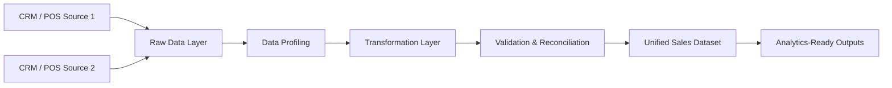

# Production-Grade Sales Data Pipeline

Production-oriented data pipeline designed to reconcile sales data from multiple CRM/POS sources, validate data quality, and generate analytics-ready outputs using Python, SQL, and SQLite.

## Tech Stack

- Python
- SQL
- SQLite
- Pandas
- Data Validation & Reconciliation
- ELT Pipelines
- Analytical Reporting

## Architecture

## Architecture



## Business Context

The Marketing and Strategy & Planning (S&P) teams were reporting different sales numbers for the same period. After investigation, it was discovered that sales data originated from two independent CRM vendors and had never been consolidated into a unified source of truth.

The objective of this exercise was to design a lightweight ETL pipeline capable of ingesting, validating, standardizing and consolidating both datasets into a curated analytics-ready sales table.

# Assumptions

- sales_id is unique within each CRM source
- total_sales should equal quantity_sold * unit_price
- CRM_1 and CRM_2 represent independent vendor systems
- Missing vendor-specific fields are preserved as NULL values
- sales_unified is intended to serve as the single source of truth

---

# Solution Overview

The solution was implemented using:

- Python
- SQLite
- SQL transformations
- CSV raw ingestion

The pipeline follows a layered ETL architecture:

```text
Raw CSV files
    ↓
Raw tables
    ↓
SQL profiling & validation
    ↓
Staging layer
    ↓
Curated unified sales table
    ↓
Analytics-ready exports
```

---

# Project Structure

```text
didi_etl_exercise/
│
├── data/
│   ├── raw_pos_1.csv
│   └── raw_pos_2.csv
│
├── output/
│   ├── sales_unified.csv
│   └── validation_summary.csv
│
├── sql/
├── 01_profiling.sql
├── 02_transform.sql
├── 03_validation.sql
├── 04_serving_layer.sql
│
├── didi_sales.db
├── run_etl.py
└── README.md
```

---

# Pipeline Layers

## 1. Raw Layer

Tables:
- crm1_raw
- crm2_raw

Purpose:
- preserve original source data
- maintain auditability
- avoid direct transformations over raw ingestion

---

## 2. Profiling & Validation

SQL profiling was executed before transformations to validate:

- row counts
- duplicate sales_id
- schema differences
- sales calculation consistency
- total sales by source

Key findings:
- CRM vendors had different schemas
- CRM 1 included:
  - email
  - transaction_id
  - payment_method
- CRM 2 did not contain those fields
- product_id had inconsistent data types across sources
- no duplicated sales_id records were found
- sales calculations were mathematically consistent

---

## 3. Staging Layer

Tables:
- crm1_staging
- crm2_staging

Purpose:
- standardize schemas
- align data types
- preserve missing fields as NULL
- add source lineage

Key transformations:
- standardized product_id as TEXT
- normalized sales_date formatting
- added source_system column

---

## 4. Curated Layer

Table:
- sales_unified

Purpose:
- provide a single source of truth for analytics consumption
- unify Marketing and S&P reporting

---

# Validation Results

## Row Counts

| Source | Rows |
|---|---|
| CRM_1 | 100 |
| CRM_2 | 1000 |

---

## Total Sales

| Source | Total Sales |
|---|---|
| CRM_1 | 114625.94 |
| CRM_2 | 1363459.70 |

Unified Total Sales:
1478085.64

---

# Scalability Considerations

For production-grade implementation, the following improvements could be added:

- Airflow orchestration
- dbt transformation models
- automated data quality tests
- cloud data warehouse integration
- observability and alerting
- incremental loading strategies

---

## Pipeline Capabilities

This pipeline simulates a production-oriented sales reconciliation workflow designed to unify and validate transactional data from multiple CRM/POS systems.

Core capabilities include:

- Multi-source sales data ingestion
- Schema consistency checks
- Data profiling and quality validation
- Transformation into a unified analytical layer
- Sales reconciliation across systems
- Analytics-ready reporting outputs
- Structured SQL-based transformation workflow

The project was designed to emulate real-world enterprise data engineering and analytics engineering practices commonly used in financial and operational reporting environments.

---

# Key Engineering Decisions

- SQLite was selected as a lightweight relational engine for rapid local execution.
- Raw ingestion tables were preserved for auditability and debugging.
- Transformations were isolated in SQL files to improve maintainability.
- A staging layer was implemented before unification to avoid direct raw unions.
- Source lineage was preserved using source_system identifiers.

---

# Final Outcome

The exercise successfully consolidated fragmented CRM data into a unified analytics-ready sales dataset while maintaining data lineage, reproducibility and validation controls.

## Outputs

The pipeline generates:

- Unified sales datasets
- Validation summaries
- Analytics-ready reporting tables
- Reconciliation outputs for downstream analysis

## Additional Enhancements

- Added ingestion_timestamp for traceability and future incremental loading support.

## How to Run

Clone the repository:

```bash
git clone https://github.com/torojacobo/production-grade-sales-data-pipeline.git
```

Install dependencies:

```bash
pip install -r requirements.txt
```

Run the pipeline:

```bash
python run_etl.py
```